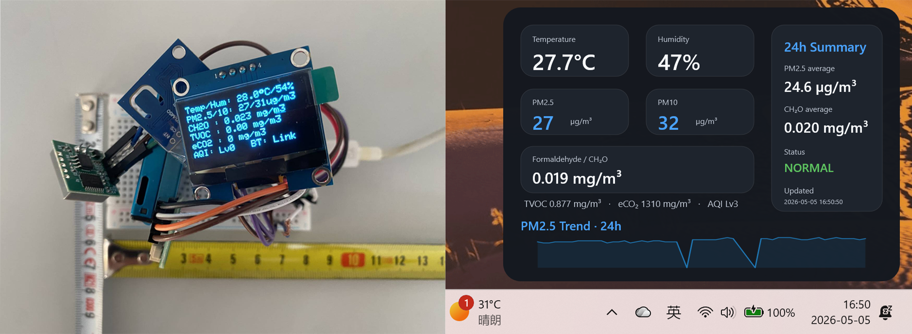

# AirMonitorDesk

AirMonitorDesk is a DIY desktop air quality monitor based on ESP32-C3, BLE communication, and a Rainmeter desktop widget.

The device measures PM2.5, PM10, formaldehyde / CH₂O, temperature, humidity, TVOC, and eCO₂. The data is displayed on both a small OLED screen and a Windows Rainmeter desktop dashboard.



---

## Features

- PM2.5 and PM10 monitoring
- Formaldehyde / CH₂O monitoring
- Temperature and humidity monitoring
- TVOC and eCO₂ estimation
- OLED real-time display
- BLE data transmission
- Rainmeter desktop dashboard
- 24-hour PM2.5 trend display
- Desktop status warning display

---

## Project Structure

```text
AirMonitorDesk/
│
├─ README.md
├─ LICENSE
│
├─ firmware/
│  └─ AirMonitorDesk/
│     └─ AirMonitorDesk.ino
│
├─ hardware/
│  └─ wiring_diagram.png
│
├─ rainmeter/
│  └─ AirMonitorDesk_1.0.rmskin
│
└─ docs/
   └─ preview.png
```

---

## Hardware

Main controller module:

- ESP32-C3 SuperMini module

Sensors and modules:

- PMS7003 particulate matter sensor
- ZE08-CH2O formaldehyde sensor
- ENS160 + AHT20 air quality and temperature/humidity sensor
- SH1106 OLED display

---

## Wiring Diagram

See:

```text
hardware/wiring_diagram.png
```

This project uses a module-level wiring diagram for manual wiring and prototyping.

It is not intended as a PCB manufacturing schematic.

---

## Pin Mapping

| Module | Signal | ESP32-C3 Pin |
|---|---|---|
| OLED / ENS160 + AHT20 | SDA | GPIO0 |
| OLED / ENS160 + AHT20 | SCL | GPIO1 |
| PMS7003 | TXD → ESP32 RX | GPIO3 |
| PMS7003 | RXD ← ESP32 TX | GPIO4 |
| ZE08-CH2O | TXD → ESP32 RX | GPIO6 |
| ZE08-CH2O | RXD ← ESP32 TX | GPIO7 |

---

## Firmware

Open the firmware in Arduino IDE:

```text
firmware/AirMonitorDesk/AirMonitorDesk.ino
```

Upload it to the ESP32-C3 board.

### Arduino Libraries

The firmware uses the following libraries:

- ESP32 Arduino core
- Adafruit GFX Library
- Adafruit SH110X
- Adafruit AHTX0
- ScioSense ENS160

The BLE library is provided by the ESP32 Arduino core.

---

## Rainmeter Desktop Widget

Install the Rainmeter package:

```text
rainmeter/AirMonitorDesk_1.0.rmskin
```

The Rainmeter package includes the desktop skin and the helper scripts required for BLE data receiving.

After installation, the skin can automatically start the BLE helper when the skin is loaded or refreshed. The helper is stopped when the skin is unloaded or Rainmeter is closed.

---

## Python Dependencies

The Rainmeter helper requires Python and the following packages:

```text
bleak
matplotlib
```

Install dependencies with:

```powershell
pip install -r requirements.txt
```

Or install manually:

```powershell
pip install bleak matplotlib
```

---

## BLE Device

The firmware advertises the device as:

```text
AirMonitor-C3
```

The desktop helper searches for this BLE device name.

If multiple AirMonitor-C3 devices are nearby, change the BLE device name in the firmware and inside the helper script included in the Rainmeter package.

Firmware example:

```cpp
BLEDevice::init("AirMonitor-C3-01");
```

---

## BLE Protocol

The ESP32-C3 sends data in the following format:

```text
ENV,seq,pm25,pm10,ch2o,temp,hum,tvoc,eco2,aqi
```

Example:

```text
ENV,12,15,17,0.025,24.6,43,70,495,2
```

Field meaning:

| Field | Description | Unit |
|---|---|---|
| seq | Packet sequence number | - |
| pm25 | PM2.5 concentration | µg/m³ |
| pm10 | PM10 concentration | µg/m³ |
| ch2o | Formaldehyde concentration | mg/m³ |
| temp | Temperature | °C |
| hum | Relative humidity | % |
| tvoc | TVOC value from ENS160 | ppb |
| eco2 | Equivalent CO₂ value from ENS160 | ppm |
| aqi | ENS160 AQI level | - |

---

## Desktop Status Rules

The Rainmeter widget shows one status message at a time.

If multiple warning items are triggered, the status text rotates every 5 seconds.

### PM2.5

| Range | Status |
|---|---|
| 35.5–55.4 µg/m³ | PM2.5 Warning |
| > 55.4 µg/m³ | PM2.5 Danger |

### PM10

| Range | Status |
|---|---|
| 155–254 µg/m³ | PM10 Warning |
| ≥ 255 µg/m³ | PM10 Danger |

### CH₂O

| Range | Status |
|---|---|
| 0.055–0.123 mg/m³ | CH₂O Warning |
| > 0.123 mg/m³ | CH₂O Danger |

### AQI

| Range | Status |
|---|---|
| AQI ≤ 3 | NORMAL |
| AQI = 4 | AQI Warning |
| AQI ≥ 5 | AQI Danger |

Connection status:

| Status | Meaning |
|---|---|
| ONLINE | BLE helper is connected or waiting for valid data |
| OFFLINE | Device is not found or disconnected |
| NORMAL | No warning or danger condition is detected |

---

## Notes

### TVOC

TVOC is a mixed-gas estimate from the ENS160 sensor.

The displayed mg/m³ value is an approximate conversion using an equivalent molecular weight. It is intended for display and trend observation only.

### eCO₂

eCO₂ is an equivalent CO₂ estimate from the ENS160 sensor.

It is not a direct NDIR CO₂ measurement.

### CH₂O

CH₂O is calculated from the ZE08-CH2O sensor output and displayed in mg/m³.

---

## Recommended Use

This project is intended for:

- Desktop air quality monitoring
- DIY environmental sensing
- ESP32-C3 BLE experiments
- Rainmeter widget development
- Hardware prototyping and learning

It is not intended for certified environmental monitoring, industrial safety, medical use, or regulatory compliance.

---

## License

This project is released under the MIT License.

See:

```text
LICENSE
```

---

## Author

Di Liu
